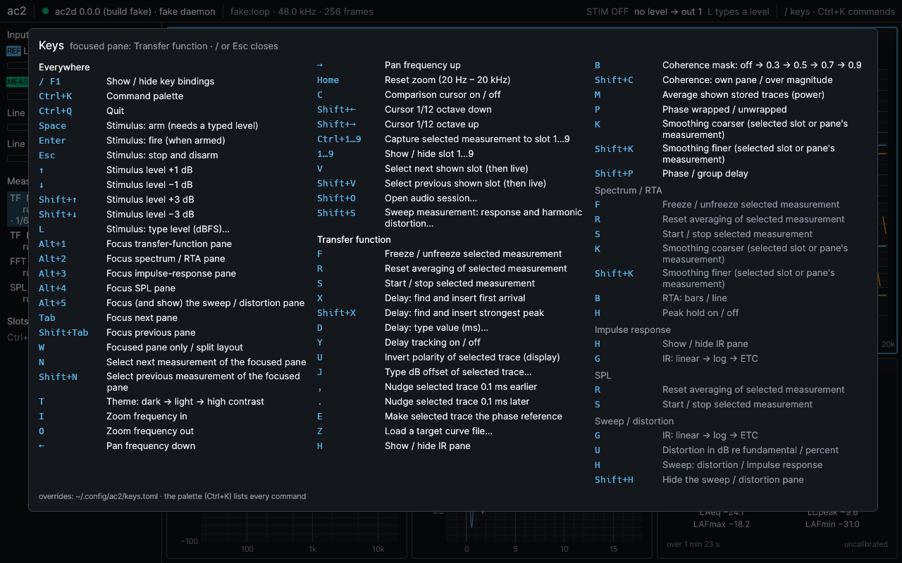
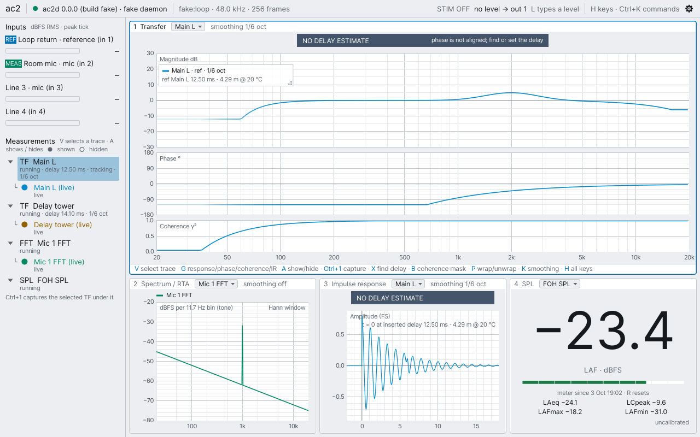
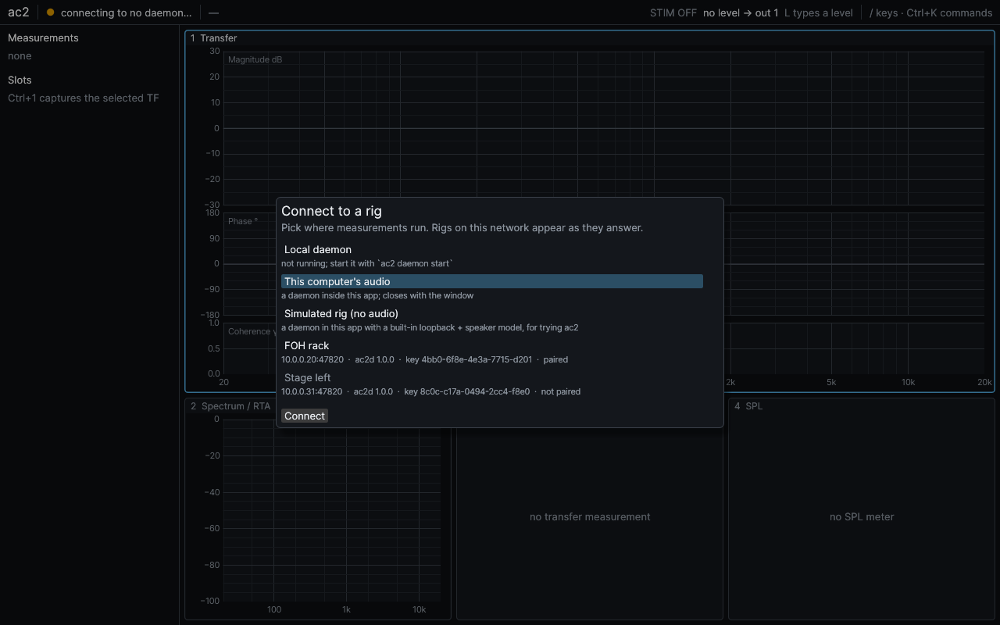

# ac2

Open-source live dual-channel FFT analyzer for PA system tuning — Linux (ALSA, PipeWire,
JACK), macOS, Windows. A Rust daemon owns the audio interface; a GPU desktop app, a CLI and
your own scripts connect to it over ZeroMQ, on the same machine or across the network
(encrypted and paired).


- **Transfer function** with coherence (multi-time-window FFT ladder, 48 points per octave),
  averaging, freeze, smoothing, fault banners that say what is wrong instead of drawing a
  plausible curve.
- **Delay finder** that targets the first arrival, reports confidence and candidates, and
  says "no estimate" rather than guessing; delay tracking.
- **Spectrum, RTA** (1/1 … 1/24 octave, A/C/Z) and a **calibrated SPL meter** (Fast / Slow /
  Impulse, Leq, LCpeak, Lmax / Lmin); per-mic sensitivity and mic-curve calibration.
- **Traces**: capture to slots with full metadata, comparison cursor, averaging, A − B, target
  curves, CSV import / export; **sessions** that always reload disarmed.
- **Keyboard first**: one scoped binding table, a command palette, layout-safe defaults,
  remappable keys. Safe stimulus: typed level, arm then fire, Esc always stops.
- **Several clients at once**, FOH and stage, discovered over mDNS, paired with pinned keys.

| | |
|---|---|
|  |  |
|  |  |

## Get it

Download from [Releases](https://github.com/mkovero/ac2/releases): a tarball and an
AppImage for Linux, a universal disk image for macOS, an MSI for Windows. Then follow
**[docs/install.md](docs/install.md)** — from download to a live transfer function in about
two minutes, with or without hardware (a simulated rig is built in).

## Documentation

- [Install and first measurement](docs/install.md), including remote use (FOH ↔ stage).
- [User guide](docs/user-guide.md): reference wiring, transfer measurement, delay finder,
  traces and slots, sessions, calibration, SPL, the full keyboard map.
- [Protocol](docs/protocol.md): the normative reference for integrations — every command,
  event and data frame the daemon speaks, plus mDNS discovery. Python cross-language
  fixtures in `tools/protocol/`.
- [PLAN.md](PLAN.md) for scope and architecture; design notes in [docs/design](docs/design).

## Status

Release 1.0 candidate (phase 6 of [PLAN.md](PLAN.md#9-phases)): packaging, installers and
documentation are done; installers are not yet code-signed. ASIO and the phase 7 extras
(SPL logging, ESS IR and room metrics, spectrograph) come after 1.0.

## Building from source

Rust (version pinned in `rust-toolchain.toml`) and a C/C++ toolchain; on Linux also
`pkg-config cmake libasound2-dev libjack-jackd2-dev libudev-dev`.

```sh
cargo build --release -p ac2d -p ac2-cli -p ac2-ui     # --features ac2d/jack,ac2-ui/jack for JACK
cargo test --workspace
```

Release packaging: `packaging/` (scripts per OS) and `.github/workflows/release.yml`.

License: MIT.
