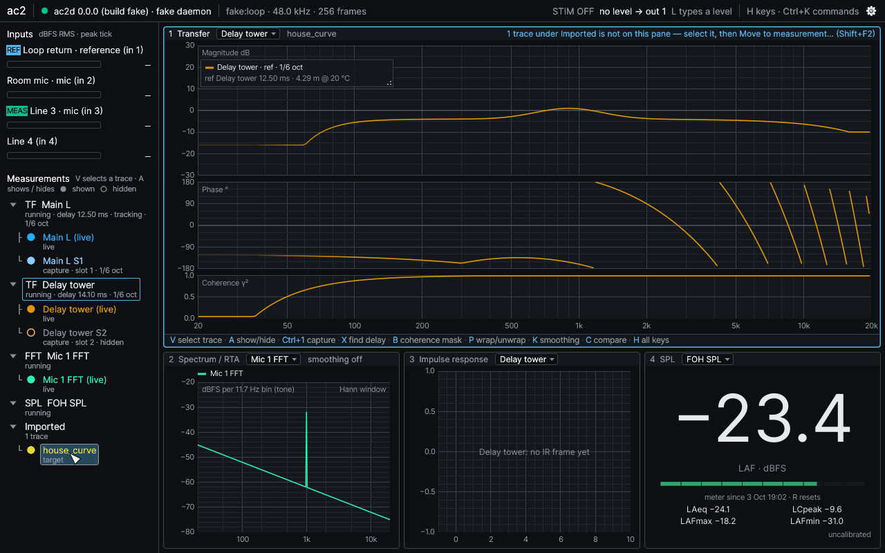
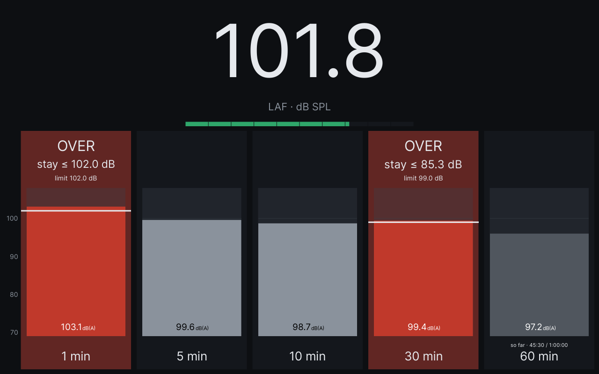
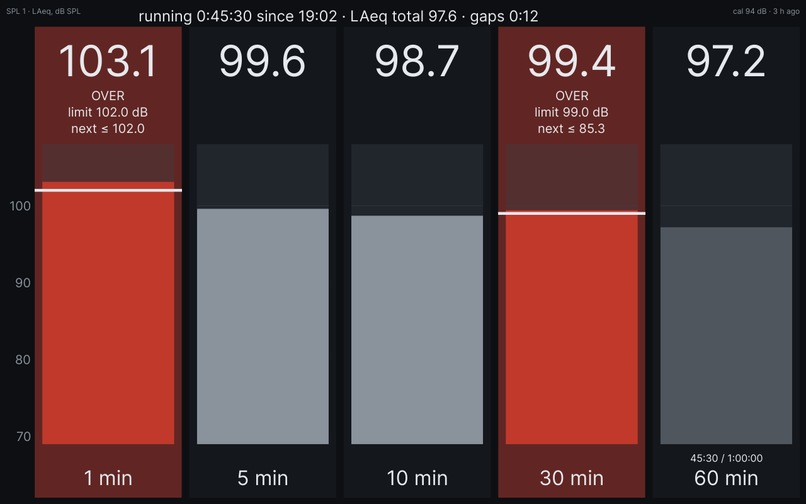
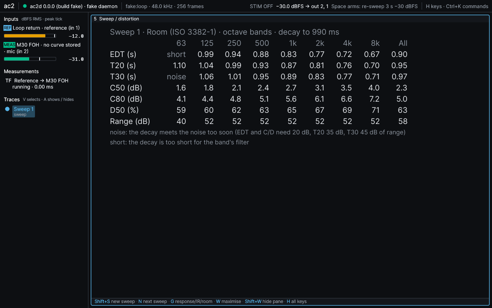
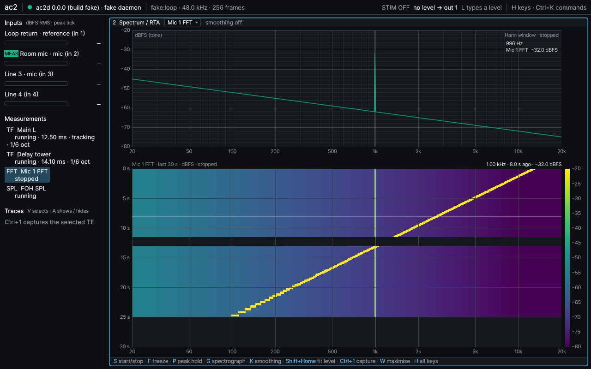
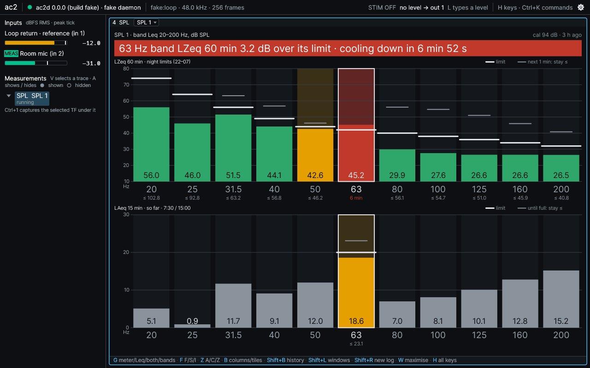
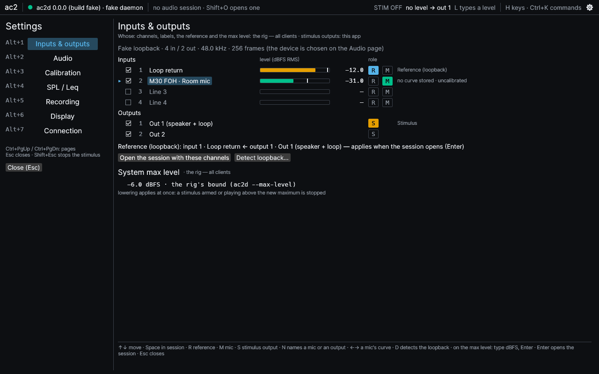
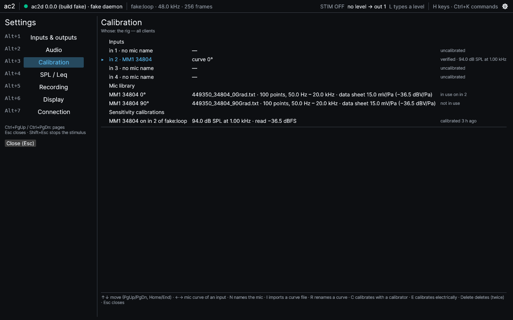

# ac2

Open-source live dual-channel FFT analyzer for PA system tuning — Linux (JACK: JACK2 or
PipeWire through pipewire-jack), macOS (Core Audio), Windows (WASAPI). A Rust daemon owns
the audio interface; a GPU desktop app, a CLI and your own scripts connect to it over
ZeroMQ, on the same machine or across the network (encrypted and paired).



- **Transfer function** with coherence (multi-time-window FFT ladder, 48 points per octave),
  averaging, freeze, magnitude and phase smoothing, fault banners that say what is wrong
  instead of drawing a plausible curve.
- **Delay finder** that targets the first arrival, reports confidence and candidates, and
  says "no estimate" rather than guessing; delay tracking.
- **Sweep measurement**: a synchronised exponential sweep gives the response, harmonic
  distortion H2 … H5 and THD vs frequency (dB re fundamental or %, each order against its
  own noise floor) and the impulse response, with a progress strip and **Stop**.
- **Room parameters** (ISO 3382-1) from every sweep: EDT, T20, T30, C50, C80, D50 per
  octave or third-octave band, with words instead of numbers where the decay cannot support
  a value.
- **Spectrum and RTA** (1/1 … 1/24 octave, A/C/Z), on a dBFS or, calibrated, a dB SPL axis,
  with a **spectrograph** under (or instead of) the spectrum.
- **Math channels**: live A ÷ B, A × B, A + B (summation prediction), A − B and spatial
  averages (power, complex, coherence-weighted) of measurements and stored traces.
- **SPL meter**: Fast / Slow / Impulse and A / C / Z switched in place (A-weighted Fast by
  default), a held big number, Leq, LCpeak, Lmax / Lmin; three views — meter, Leq windows,
  or both, made to be read from the stage.
- **Rolling Leq windows and limits**: columns or tiles, each in its own weighting (dB(A),
  dB(C)), judged against their limits, a
  filling window judged on its energy budget ("ON COURSE — over in 12 min"), headroom
  ("next 1 min: stay ≤ 101.5 dB") and "cooling down in …"; a per-second log that runs
  whether or not anyone watches, with its run clock, total Leq and offline time (missing audio
  is never counted as silence), a history strip that survives an app restart, a new log at show
  start; informational presets that replace the windows with a rule's (DIN 15905-5,
  Switzerland, WHO, France, Flanders, Brussels, the Dutch covenant, Finland).
- **Band Leq for the neighbours**: 1/3-octave band Leq in up to eight windows of their own
  length and Z/A/C weighting against per-band limits (preset: Finland STM 545/2015), on the
  bands you keep, moved from a named receiving place to the FOH mic by a measured band
  transfer, with the predicted LAeq there.
- **Raw recording and replay**: record every input to f32 WAV / RF64, replay a recording
  (or a recorder's WAV) as a capture-only session and measure it again.
- **Calibration**: per input against an acoustic calibrator, or **electrically** without
  one (a voltmeter across the mic's pins 2–3 and its data-sheet sensitivity, ±1 dB); a **mic
  library** with labelled curves per mic (0°, 90° …) and an explicitly chosen curve per
  input; a Calibrations view; every readout names what its dB SPL rests on.
- **Named, metered inputs**: Settings › Inputs & outputs and an always-on meter strip show every
  input by name with its role (reference, mic) and level, before and during measuring.
- **Measurement tree and traces**: every capture, sweep run, math result and import filed
  under the measurement it came from, each measurement in its own colour family; rename,
  delete, show / hide, slots, display offsets to spread curves apart, a comparison cursor,
  target curves, smoothing and a mic curve applied after capture, CSV import / export (a
  sweep round-trips with its distortion and impulse response).
- **Sessions and autosave**: save and load by name; a stand-alone daemon autosaves and
  restores on restart, always disarmed.
- **Keyboard first**: one remappable binding table, layout-safe defaults, a command palette,
  **H** for every key, per-pane key hints and tooltips; per-pane level-axis zoom / pan / fit;
  layouts split → one pane → full screen (**W**), remembered between runs.
- **Safe stimulus**: typed level, arm then fire, Esc stops, **Shift+Esc** stops from
  anywhere; an open window owns the keyboard and never touches the stimulus.
- **Several clients at once**, FOH and stage, discovered over mDNS, paired with pinned keys;
  a CLI and a documented protocol for scripts.

| | |
|---|---|
|  |  |
|  |  |
|  |  |
|  |  |

## Get it

There is no published release yet. Installers are built by the
[Release workflow](https://github.com/mkovero/ac2/actions/workflows/release.yml): open its
latest successful run (**Actions → Release**) and download an artifact — `dist-linux`
(tarball and AppImage), `dist-macos` (universal disk image and zip), `dist-windows` (MSI and
zip), or `release-<version>` (all of them with `SHA256SUMS`). Artifacts need a signed-in
GitHub account and expire after the repository's retention period; a maintainer starts a new
build with `gh workflow run release.yml`. The installers are **not code-signed**: macOS and
Windows warn on first start ([install.md](docs/install.md) says how to proceed). Or
[build from source](#building-from-source).

Then follow **[docs/install.md](docs/install.md)** — from download to a live transfer
function in about two minutes, with or without hardware (a simulated rig is built in).

## Documentation

- [Install and first measurement](docs/install.md), including remote use (FOH ↔ stage).
- [User guide](docs/user-guide.md): reference wiring, transfer measurement, delay finder,
  the measurement tree and traces, sweeps, distortion and room parameters, sessions and
  autosave, calibration and the mic library, SPL, Leq windows and band Leq, the full
  keyboard map.
- [Protocol](docs/protocol.md): the normative reference for integrations — every command,
  event and data frame the daemon speaks, plus mDNS discovery. Python cross-language
  fixtures in `tools/protocol/`.
- [PLAN.md](PLAN.md) for scope and architecture; design notes in [docs/design](docs/design);
  hardware runs in [docs/rigs](docs/rigs).

## Status

Pre-1.0 (version 0.0.0; no compatibility promised between builds: protocol, session and
calibration-store versions are checked and a mismatch is refused or set aside, never
guessed). Phases 0–6 of [PLAN.md](PLAN.md#9-phases) — audio, DSP, daemon and protocol, UI,
calibration / SPL / sessions, packaging and documentation — meet their CI criteria. Of the
post-1.0 phase 7, the sweep with distortion, impulse response and room parameters, the
spectrograph, math channels and spatial averages, rolling Leq windows with the per-second
log, band Leq, raw recording and replay, and the Settings view are done; ASIO and
multi-device support are open.

The hardware acceptance runs are still open ([status table](PLAN.md#90-status-2026-10-05)):

- **Linux**: verified on a real rig (JACK, RME Fireface 400): transfer, delay finder, sweeps,
  electrical SPL calibration, remote use over CURVE and mDNS, a 24 h SPL log, cross-checked
  against REW ([docs/rigs/pupu.md](docs/rigs/pupu.md)); a Raspberry Pi 4 runs the app as a
  touch kiosk client.
- **Windows**: the MSI installs and the app runs the simulated rig (checked in a VM); WASAPI
  on a real interface is untested.
- **macOS**: the universal disk image installs and starts on a tester's Mac; not yet
  measured with an audio interface ([testing/macos](testing/macos/README.md)).
- Builds are not code-signed, and there are no GitHub Releases: installers are artifacts of
  the Release workflow ([Get it](#get-it)).

## Building from source

Rust (version pinned in `rust-toolchain.toml`) and a C/C++ toolchain; on Linux also
`pkg-config cmake libjack-jackd2-dev libudev-dev`. libjack is loaded at run time, so the
binaries run (and say why audio is unavailable) where JACK is not installed; nothing links
ALSA.

```sh
cargo build --release -p ac2d -p ac2-cli -p ac2-ui
cargo test --workspace
```

Release packaging: `packaging/` (scripts per OS) and `.github/workflows/release.yml`.

## Files

Every ac2 program finds its files through one helper (`crates/ac2-paths`), in the platform's
own directories:

| what | Linux | macOS | Windows |
|---|---|---|---|
| config: calibration store (`calibrations.json`: sensitivity calibrations, the mic library, each input's mic and active curve), UI preferences (`ui.toml`), key bindings (`keys.toml`), network keys (`server.key`, `authorized_clients`, `keys/`) | `~/.config/ac2` | `~/Library/Application Support/ac2` | `%APPDATA%\ac2\config` |
| data: saved sessions (`sessions/<name>/`), the daemon's autosave (`autosave/`, the previous manifest in `autosave/session.prev.json`), raw recordings (`recordings/`) | `~/.local/share/ac2` | `~/Library/Application Support/ac2` | `%APPDATA%\ac2\data` |

A session directory holds `session.json` (measurements, trace metadata, slots), one CSV per
trace and one per-second log per SPL meter (`spl/`). The autosave is the same format, updated in place: unchanged traces are not written again and SPL logs are appended to.
Autosaves and calibration stores this build cannot read are set aside, never deleted:
`autosave.v<N>/` (another session format), `autosave.damaged/`, `autosave.unrestored/`
(what `ac2d --no-restore` did not load) and `calibrations.json.v<N>` (another store version:
calibrate and import the curves again). Sessions of another format are refused with the
version named.

`XDG_CONFIG_HOME` / `XDG_DATA_HOME` apply on Linux. `AC2_CONFIG_DIR` moves the config
directory, `AC2_SESSION_DIR` the sessions, `ac2d --cal-store PATH` the calibration store,
`ac2d --autosave DIR` the autosave (`--no-autosave` keeps everything in memory).
Calibrations describe the machine's hardware and stay in the config directory; sessions are
the operator's documents and live in the data directory.

License: MIT.
