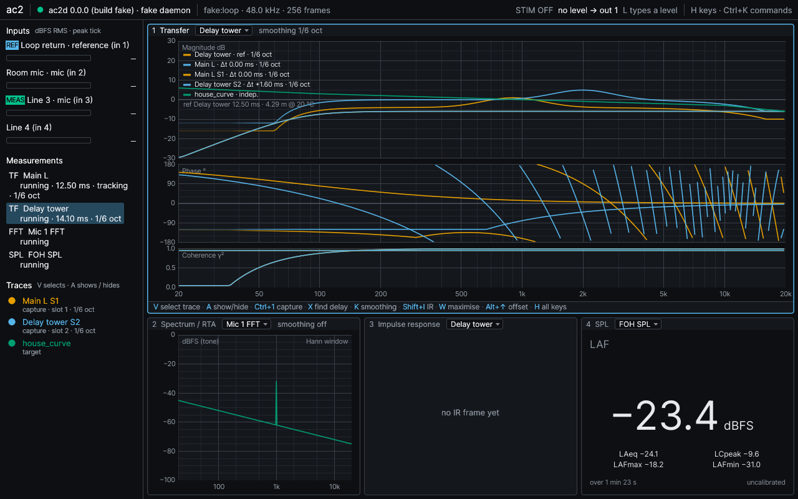
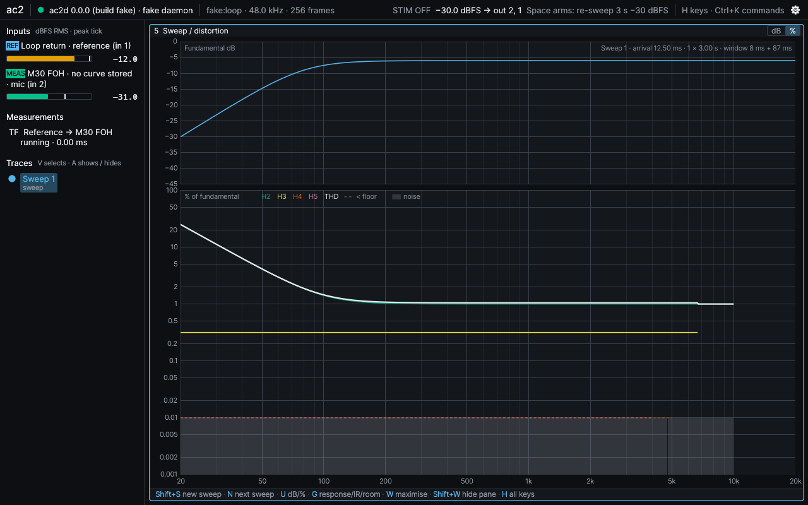
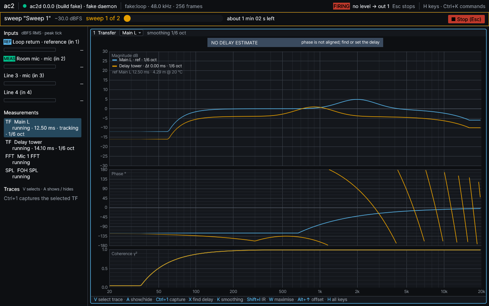
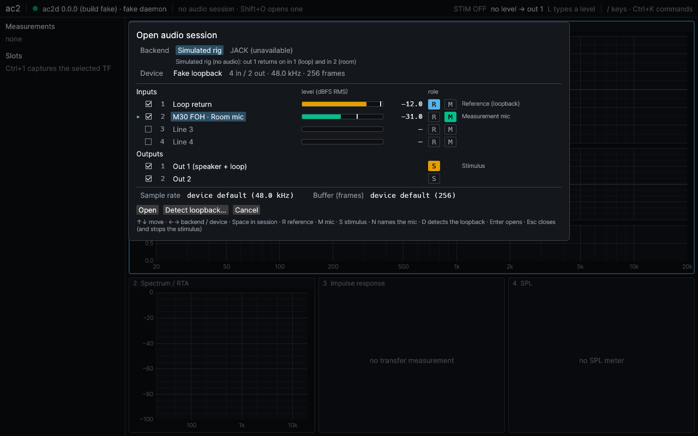
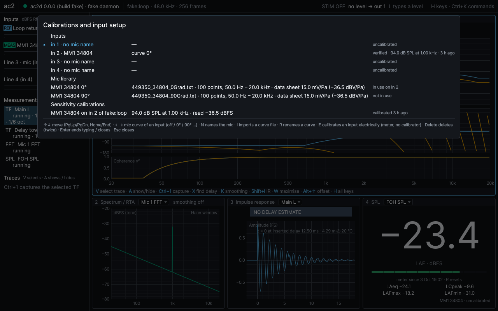
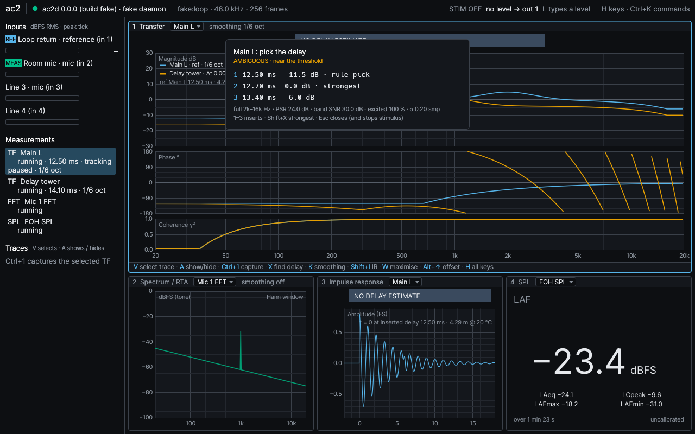
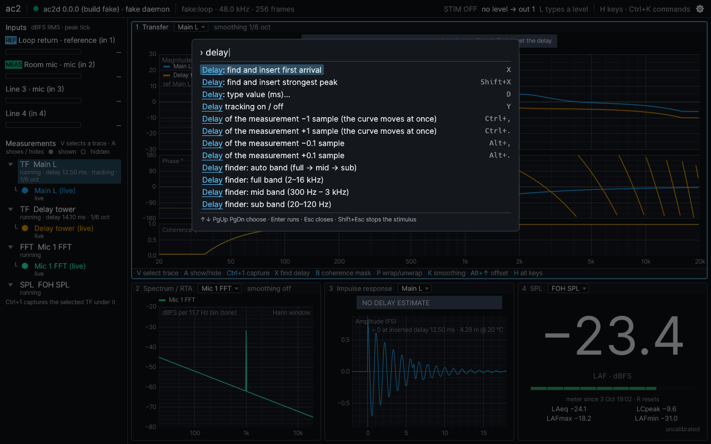

# ac2

Open-source live dual-channel FFT analyzer for PA system tuning — Linux (JACK: JACK2 or
PipeWire through pipewire-jack), macOS (Core Audio), Windows (WASAPI). A Rust daemon owns
the audio interface; a GPU desktop app, a CLI and your own scripts connect to it over
ZeroMQ, on the same machine or across the network (encrypted and paired).



- **Transfer function** with coherence (multi-time-window FFT ladder, 48 points per octave),
  averaging, freeze, magnitude and phase smoothing, fault banners that say what is wrong
  instead of drawing a plausible curve.
- **Delay finder** that targets the first arrival, reports confidence and candidates, and
  says "no estimate" rather than guessing; delay tracking.
- **Sweep measurement**: a synchronised exponential sweep gives the response, harmonic
  distortion H2 … H5 and THD vs frequency (in dB re fundamental or in %, each order drawn
  against its own noise floor) and the impulse response; a progress strip with **Stop** while
  it runs.
- **Spectrum, RTA** (1/1 … 1/24 octave, A/C/Z) and a **calibrated SPL meter** (Fast / Slow /
  Impulse, Leq, LCpeak, Lmax / Lmin) with **rolling Leq windows**, limits, alarms and
  informational regulation presets (DIN 15905-5, Switzerland, WHO, France, Flanders,
  Brussels, the Dutch covenant), and a per-second log that keeps running whether or not
  anyone watches.
- **Calibration**: per-input sensitivity against an acoustic calibrator; a **mic library**
  with several labelled curves per mic (0°, 90° …) and an explicitly chosen active curve per
  input; a Calibrations view that shows what every input uses.
- **Named, metered inputs**: the session dialog and an always-on meter strip show every
  input by name with its role (reference, mic) and level, before and during measuring.
- **Traces**: capture to slots with full metadata, comparison cursor, averaging, A − B, target
  curves, smoothing and a mic curve applied after capture (from the app or the CLI), CSV
  import / export (a sweep round-trips with its distortion and impulse response).
- **Sessions and autosave**: save and load by name; a stand-alone daemon autosaves
  measurements and traces and restores them on restart, always disarmed.
- **Keyboard first**: one scoped binding table, a command palette, layout-safe defaults,
  remappable keys. Safe stimulus: typed level, arm then fire, Esc always stops.
- **Several clients at once**, FOH and stage, discovered over mDNS, paired with pinned keys.

| | |
|---|---|
|  |  |
|  |  |
|  |  |

## Get it

There is no published release yet. Installers are built by the
[Release workflow](https://github.com/mkovero/ac2/actions/workflows/release.yml): open its
latest successful run (**Actions → Release**) and download an artifact — `dist-linux`
(tarball and AppImage), `dist-macos` (universal disk image and zip), `dist-windows` (MSI and
zip), or `release-<version>` (all of them with `SHA256SUMS`). Artifacts need a signed-in
GitHub account and expire after the repository's retention period; a maintainer starts a new
build with `gh workflow run release.yml`. The installers are **not code-signed**: macOS and
Windows warn on first start ([install.md](docs/install.md) says how to proceed). Or
[build from source](#building-from-source).

Then follow **[docs/install.md](docs/install.md)** — from download to a live transfer
function in about two minutes, with or without hardware (a simulated rig is built in).

## Documentation

- [Install and first measurement](docs/install.md), including remote use (FOH ↔ stage).
- [User guide](docs/user-guide.md): reference wiring, transfer measurement, delay finder,
  traces and slots, sweeps and distortion, sessions and autosave, calibration and the mic
  library, SPL and Leq windows, the full keyboard map.
- [Protocol](docs/protocol.md): the normative reference for integrations — every command,
  event and data frame the daemon speaks, plus mDNS discovery. Python cross-language
  fixtures in `tools/protocol/`.
- [PLAN.md](PLAN.md) for scope and architecture; design notes in [docs/design](docs/design);
  hardware runs in [docs/rigs](docs/rigs).

## Status

Pre-1.0 (version 0.0.0; no compatibility promised between builds: protocol, session and
calibration-store versions are checked and a mismatch is refused or set aside, never
guessed). Phases 0–6 of [PLAN.md](PLAN.md#9-phases) — audio, DSP, daemon and protocol, UI,
calibration / SPL / sessions, packaging and documentation — meet their CI criteria, and from
phase 7 the sweep with harmonic distortion and impulse response and the rolling Leq windows
with the per-second SPL log are done.

The hardware acceptance runs are still open ([status table](PLAN.md#90-status-2026-10-03)):

- **Linux**: in use on a real rig (JACK, RME Fireface 400): transfer, delay finder, sweeps,
  remote use over CURVE and mDNS ([docs/rigs/pupu.md](docs/rigs/pupu.md)).
- **Windows**: the MSI installs and the app runs the simulated rig (checked in a VM); WASAPI
  on a real interface is untested.
- **macOS**: untested on hardware (CI builds and renders headless).
- Installers are not code-signed. ASIO, room metrics (ISO 3382) and the spectrograph come
  later.

## Building from source

Rust (version pinned in `rust-toolchain.toml`) and a C/C++ toolchain; on Linux also
`pkg-config cmake libjack-jackd2-dev libudev-dev`. libjack is loaded at run time, so the
binaries run (and say why audio is unavailable) where JACK is not installed; nothing links
ALSA.

```sh
cargo build --release -p ac2d -p ac2-cli -p ac2-ui
cargo test --workspace
```

Release packaging: `packaging/` (scripts per OS) and `.github/workflows/release.yml`.

## Files

Every ac2 program finds its files through one helper (`crates/ac2-paths`), in the platform's
own directories:

| what | Linux | macOS | Windows |
|---|---|---|---|
| config: calibration store (`calibrations.json`: sensitivity calibrations, the mic library, each input's mic and active curve), UI preferences (`ui.toml`), key bindings (`keys.toml`), network keys (`server.key`, `authorized_clients`, `keys/`) | `~/.config/ac2` | `~/Library/Application Support/ac2` | `%APPDATA%\ac2\config` |
| data: saved sessions (`sessions/<name>/`), the daemon's autosave (`autosave/`, the previous one in `autosave.prev/`) | `~/.local/share/ac2` | `~/Library/Application Support/ac2` | `%APPDATA%\ac2\data` |

A session directory holds `session.json` (measurements, trace metadata, slots), one CSV per
trace and one per-second log per SPL meter (`spl/`). The autosave is the same format.
Autosaves and calibration stores this build cannot read are set aside, never deleted:
`autosave.v<N>/` (another session format), `autosave.damaged/`, `autosave.unrestored/`
(what `ac2d --no-restore` did not load) and `calibrations.json.v<N>` (another store version:
calibrate and import the curves again). Sessions of another format are refused with the
version named.

`XDG_CONFIG_HOME` / `XDG_DATA_HOME` apply on Linux. `AC2_CONFIG_DIR` moves the config
directory, `AC2_SESSION_DIR` the sessions, `ac2d --cal-store PATH` the calibration store,
`ac2d --autosave DIR` the autosave (`--no-autosave` keeps everything in memory).
Calibrations describe the machine's hardware and stay in the config directory; sessions are
the operator's documents and live in the data directory.

License: MIT.
